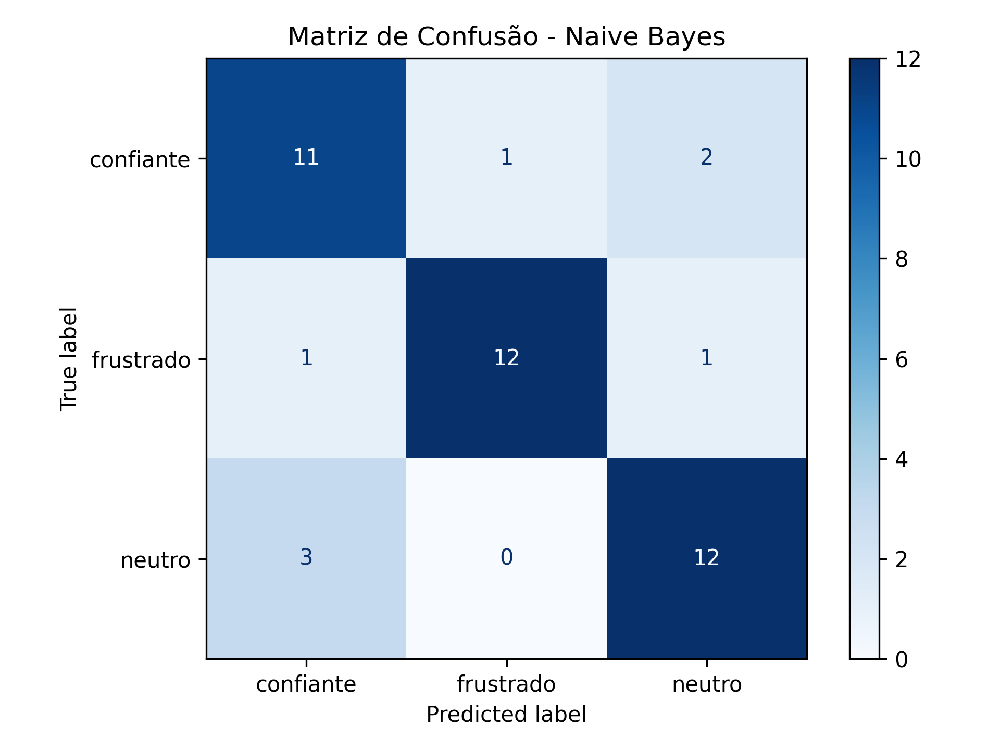
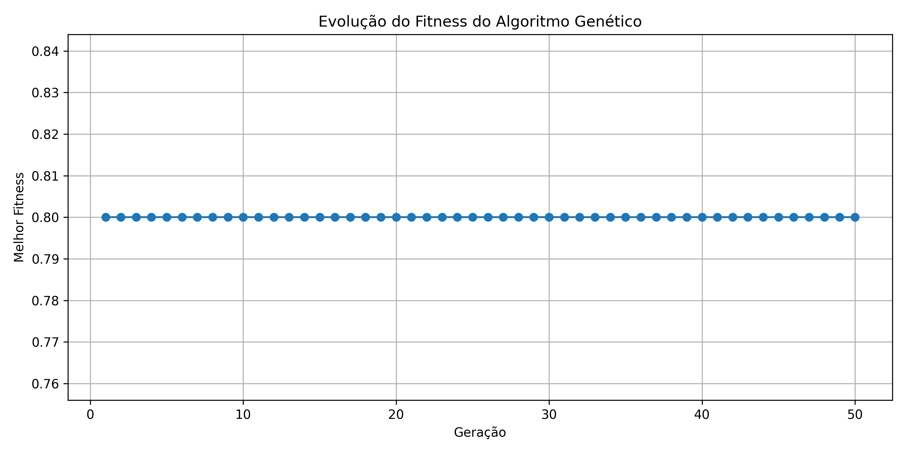
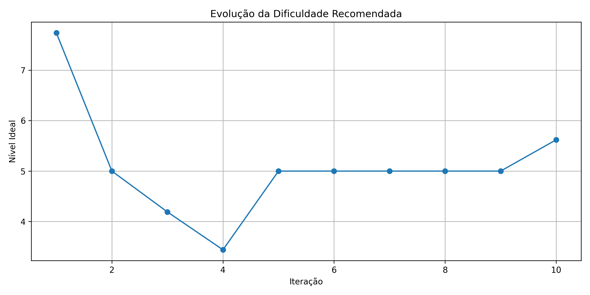
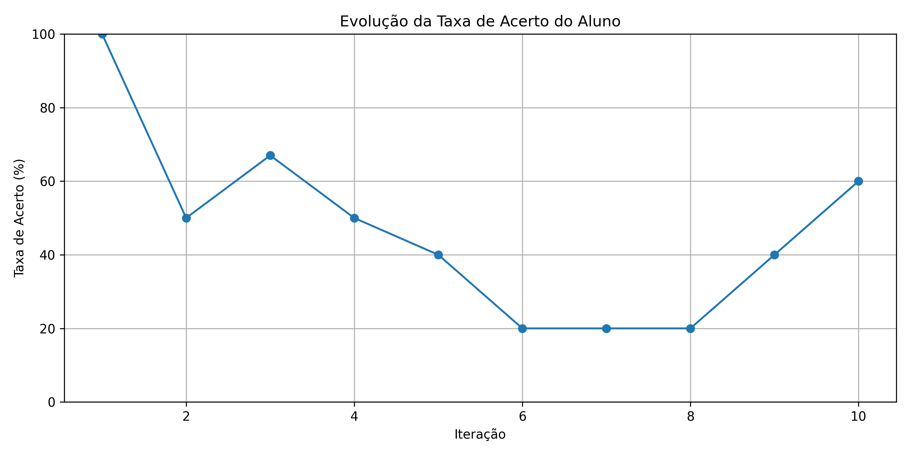

# AdaptiveLearn — Relatório Técnico

## 1. Introdução

O AdaptiveLearn é uma plataforma de aprendizagem adaptativa desenvolvida com o objetivo de ajustar dinamicamente a dificuldade dos exercícios de acordo com o desempenho do aluno.

O sistema utiliza técnicas de Processamento de Linguagem Natural (PLN), Sistema Fuzzy e Algoritmo Genético para analisar feedbacks, calcular níveis de dificuldade e recomendar exercícios personalizados.

---

## 2. Objetivo do Projeto

O projeto tem como objetivo desenvolver um sistema inteligente capaz de recomendar exercícios adaptativos com base no desempenho, tempo de resposta e feedback textual do aluno.

A proposta busca oferecer uma experiência de aprendizagem mais personalizada, ajustando automaticamente o nível de dificuldade conforme o progresso do usuário.

---

## 3. Tecnologias Utilizadas

### Backend
- Python
- FastAPI
- Scikit-Learn
- Scikit-Fuzzy
- NLTK
- NumPy

### Frontend
- Next.js
- React
- TypeScript

### Bibliotecas auxiliares
- Matplotlib
- Joblib
- Pandas

---

## 4. Arquitetura do Sistema

O sistema foi dividido em três camadas principais integradas por uma API desenvolvida com FastAPI.

O fluxo geral do sistema ocorre da seguinte forma:

1. O aluno responde um exercício e envia um feedback textual.
2. O módulo de PLN classifica o sentimento do feedback.
3. O Sistema Fuzzy calcula o nível ideal de dificuldade.
4. O Algoritmo Genético recomenda novos exercícios adaptados ao perfil do aluno.
5. O frontend exibe as recomendações dinamicamente.

---

### 4.1 PLN

A camada de Processamento de Linguagem Natural foi desenvolvida utilizando Scikit-Learn e NLTK.

O modelo utiliza o algoritmo Naive Bayes para classificar os feedbacks do aluno em categorias como:
- confiante
- neutro
- frustrado

Essas classificações são utilizadas como entrada para o Sistema Fuzzy.

---

### 4.2 Sistema Fuzzy

A camada Fuzzy é responsável por calcular o nível ideal de dificuldade dos exercícios.

O cálculo considera:
- sentimento identificado pelo PLN;
- taxa de acerto do aluno;
- tempo gasto na resolução.

O resultado produzido é um valor numérico representando a dificuldade ideal recomendada para o aluno.

---

### 4.3 Algoritmo Genético

O Algoritmo Genético é responsável pela recomendação adaptativa de exercícios.

A função fitness considera:
- proximidade da dificuldade ideal;
- diversidade de subtópicos;
- penalidade por tempo excessivo.

Durante as gerações, o algoritmo realiza:
- seleção por torneio;
- crossover;
- mutação;
- elitismo.

Ao final do processo, os exercícios mais adequados são recomendados ao aluno.

---

## 5. Fluxo de Funcionamento

O funcionamento do sistema ocorre de forma sequencial e integrada entre as camadas do projeto.

Inicialmente, o aluno resolve um exercício disponível na plataforma e envia um feedback textual descrevendo sua experiência durante a atividade.

O feedback é enviado para a camada de Processamento de Linguagem Natural (PLN), responsável por identificar o sentimento predominante do aluno. O modelo classifica o feedback em categorias como confiante, neutro ou frustrado.

Em seguida, os resultados do PLN são utilizados pela camada Fuzzy juntamente com informações de desempenho, como:
- taxa de acerto;
- tempo gasto;
- histórico recente do aluno.

Com base nesses dados, o sistema calcula o nível ideal de dificuldade recomendado para o próximo exercício.

Após o cálculo do nível ideal, o Algoritmo Genético é executado para selecionar os exercícios mais adequados ao perfil atual do aluno. O algoritmo considera critérios como:
- proximidade da dificuldade ideal;
- diversidade de subtópicos;
- tempo estimado dos exercícios.

Por fim, os exercícios recomendados são enviados ao frontend e exibidos dinamicamente ao usuário.

---

## 6. Resultados

### 6.1 Matriz de Confusão

A matriz de confusão foi utilizada para avaliar o desempenho do modelo Naive Bayes responsável pela classificação dos sentimentos dos feedbacks dos alunos.

O modelo foi treinado utilizando frases rotuladas em três categorias:
- confiante
- neutro
- frustrado

A avaliação demonstrou bom desempenho geral do classificador, apresentando métricas equilibradas entre precisão, recall e F1-score.

A figura abaixo apresenta a matriz de confusão gerada durante a etapa de avaliação do modelo.



Além da matriz, também foi gerado um relatório contendo:
- acurácia;
- precisão;
- recall;
- F1-score;
- validação cruzada.

Esses resultados demonstram que o modelo conseguiu identificar adequadamente os sentimentos presentes nos feedbacks dos alunos.

---
### 6.2 Evolução do Fitness do Algoritmo Genético

O Algoritmo Genético foi utilizado para recomendar exercícios adaptativos de acordo com o nível ideal calculado pelo Sistema Fuzzy.

Durante a execução do algoritmo, foi registrada a evolução do fitness ao longo das gerações. A função fitness considerou fatores como:
- proximidade da dificuldade ideal;
- diversidade de subtópicos;
- penalidade por tempo excessivo.

O gráfico abaixo apresenta a evolução do melhor fitness encontrado durante as gerações do algoritmo.



Observou-se que o algoritmo apresentou rápida convergência, estabilizando os valores de fitness nas primeiras gerações da execução.

---
### 6.3 Evolução da Dificuldade Recomendada

Durante a simulação da sessão do aluno, o sistema ajustou dinamicamente o nível de dificuldade recomendado com base no desempenho e nos feedbacks recebidos.

O cálculo da dificuldade foi realizado pela camada Fuzzy utilizando:
- sentimento identificado pelo PLN;
- taxa de acerto do aluno;
- tempo gasto na resolução.

O gráfico abaixo apresenta a evolução do nível ideal recomendado ao longo das interações da sessão.



Os resultados demonstram que o sistema foi capaz de adaptar o nível de dificuldade de forma dinâmica conforme o comportamento do aluno durante a utilização da plataforma.

---
### 6.4 Evolução da Taxa de Acerto

A taxa de acerto móvel foi utilizada como um dos principais indicadores de desempenho do aluno durante a sessão.

Esse valor foi calculado considerando as últimas respostas do usuário, permitindo que o sistema acompanhasse tendências recentes de desempenho em vez de utilizar apenas a média geral da sessão.

O gráfico abaixo apresenta a evolução da taxa de acerto ao longo das interações realizadas pelo aluno.



A análise demonstra que o sistema conseguiu monitorar continuamente o desempenho do aluno, fornecendo informações relevantes para o ajuste adaptativo da dificuldade dos exercícios.

---

## 7. Integração Frontend e Backend

O sistema foi dividido em dois repositórios principais:
- backend desenvolvido em Python com FastAPI;
- frontend desenvolvido em Next.js.

A comunicação entre as aplicações ocorre através de requisições HTTP utilizando endpoints disponibilizados pela API FastAPI.

O frontend realiza chamadas para o backend utilizando o método `fetch`, enviando parâmetros relacionados ao desempenho do aluno, como quantidade de acertos e tempo gasto na resolução dos exercícios.

Exemplo de endpoint utilizado:

```http
GET /nivel?acertos=8&tempo=20
```

Exemplo de resposta da API:

```json
{
  "nivel": 8.14,
  "acertos": 8,
  "tempo": 20
}
```

A integração permitiu que o frontend exibisse dinamicamente as recomendações geradas pelas camadas inteligentes do sistema.

Além disso, a utilização do FastAPI facilitou a criação de endpoints rápidos e organizados para comunicação entre as aplicações.

---

## 8. Conclusão

O projeto AdaptiveLearn demonstrou a integração prática de diferentes técnicas de Inteligência Artificial aplicadas ao contexto educacional.

A utilização de Processamento de Linguagem Natural permitiu interpretar os sentimentos presentes nos feedbacks dos alunos, enquanto o Sistema Fuzzy foi responsável por adaptar dinamicamente o nível de dificuldade recomendado.

Além disso, o Algoritmo Genético possibilitou a recomendação de exercícios de forma adaptativa, considerando critérios de desempenho, diversidade e tempo de resolução.

Os resultados obtidos demonstraram que o sistema foi capaz de:
- interpretar feedbacks textuais;
- acompanhar o desempenho do aluno;
- ajustar a dificuldade dinamicamente;
- recomendar exercícios personalizados.

A integração entre frontend e backend também permitiu o funcionamento completo da plataforma, proporcionando uma experiência interativa e adaptativa ao usuário.

Como melhorias futuras, o projeto poderá incluir:
- autenticação de usuários;
- persistência em banco de dados;
- dashboards em tempo real;
- treinamento com datasets maiores;
- deploy em ambiente web.